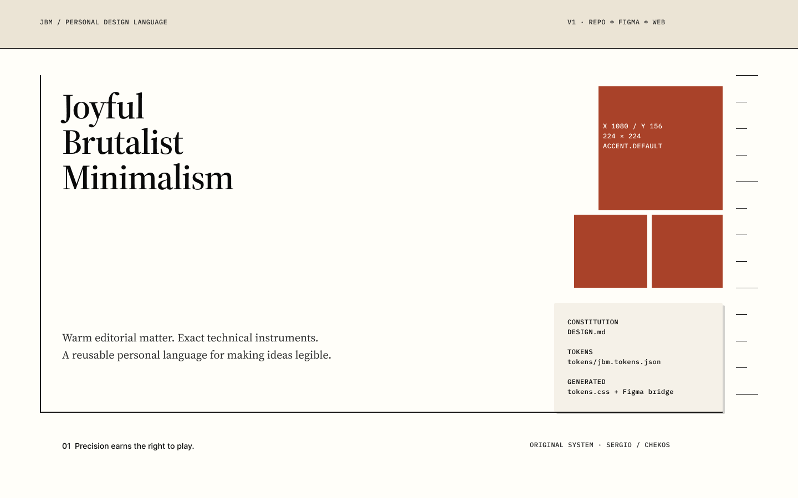
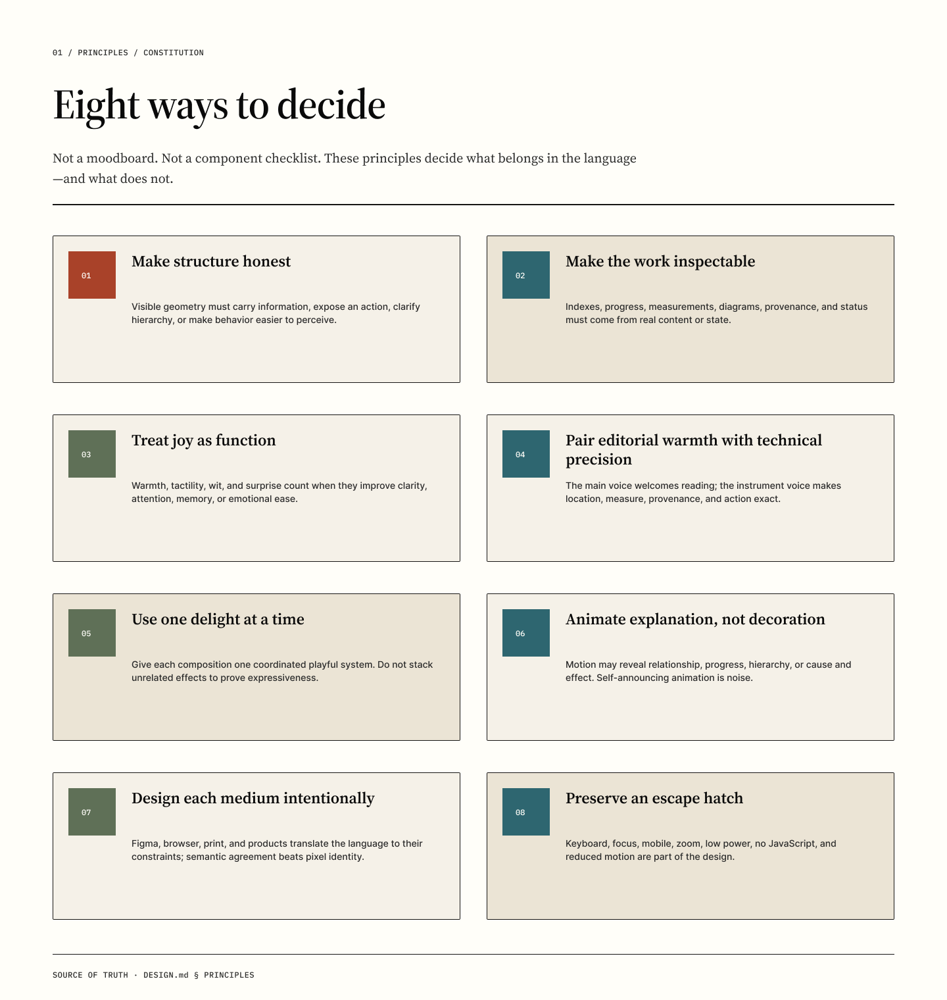
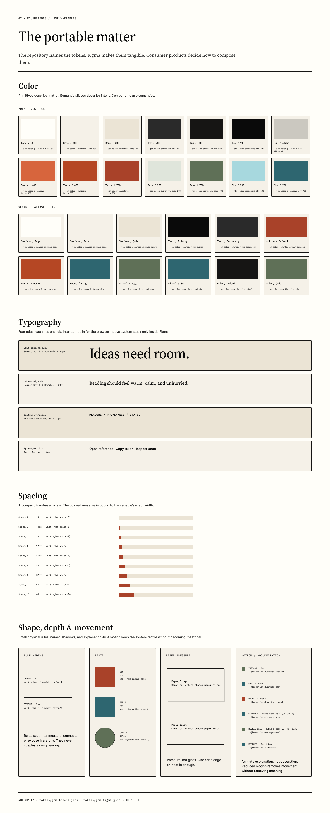
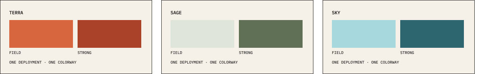
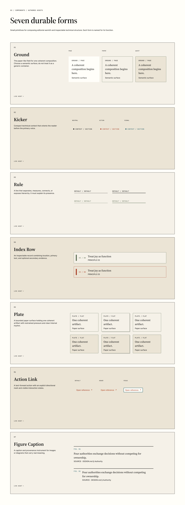
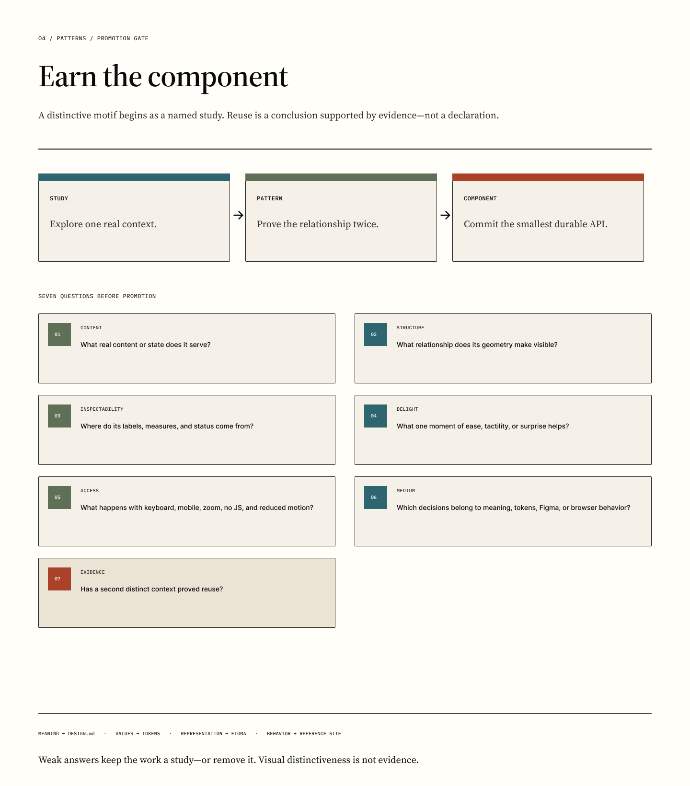
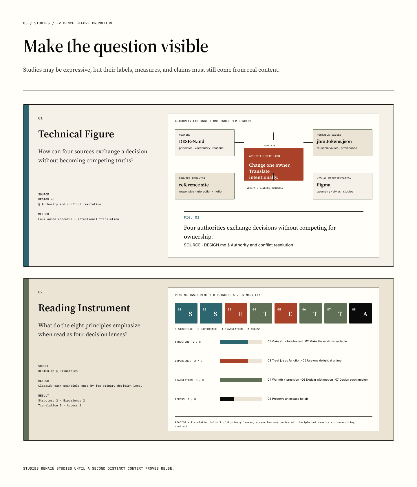

# Figma v1 inspection receipt

The editable [Joyful Brutalist Minimalism Figma file](https://www.figma.com/design/T4jEmsyQBURKMr6s3zYfFJ)
and the repository are peer access points to one authored system. Figma owns
visual representation; portable values remain canonical in the repository and
are reconciled in both directions through [`SYNC.md`](../SYNC.md).

The founding build fulfills [issue #5](https://github.com/chekos/joyful-brutalist-minimalism/issues/5)
and is reviewed in [pull request #8](https://github.com/chekos/joyful-brutalist-minimalism/pull/8).
The round-trip reconciliation and Contextual Marginalia study fulfill
[issue #24](https://github.com/chekos/joyful-brutalist-minimalism/issues/24).
The earned-scale and static-index recalibration fulfills
[issues #25–#27](https://github.com/chekos/joyful-brutalist-minimalism/issues/25).
The deployment-scoped colorway migration fulfills
[issue #31](https://github.com/chekos/joyful-brutalist-minimalism/issues/31)
through
[pull request #33](https://github.com/chekos/joyful-brutalist-minimalism/pull/33);
the independent Paper/Bone reassessment remains tracked in
[issue #32](https://github.com/chekos/joyful-brutalist-minimalism/issues/32).
The human-outcome clarity pass fulfills
[issue #35](https://github.com/chekos/joyful-brutalist-minimalism/issues/35)
through
[pull request #36](https://github.com/chekos/joyful-brutalist-minimalism/pull/36).
The responsive Principle Index correction fulfills
[issue #44](https://github.com/chekos/joyful-brutalist-minimalism/issues/44).
Its authoritative inputs are [`DESIGN.md`](../DESIGN.md),
[`tokens/jbm.tokens.json`](../tokens/jbm.tokens.json), and the generated
[`tokens/jbm.figma.json`](../tokens/jbm.figma.json). The machine-readable
inspection result is stored in [`docs/figma/v1/inspection.json`](figma/v1/inspection.json).
The repository-owned
[`recovery-manifest.json`](figma/v1/recovery-manifest.json) records the minimum
inventory needed to audit an imported copy or a manual rebuild.

## Inspection result

- Pages exist in the required order: `00 Cover`, `01 Principles`,
  `02 Foundations`, `03 Components`, `04 Patterns`, and `05 Studies`.
- `JBM Primitives` contains 28 variables and `JBM Semantics` contains 12
  semantic aliases. The semantic collection has `Terra`, `Sage`, and `Sky`
  modes, with Terra as the default. All 40 variables have deliberate scopes
  and canonical WEB code syntax.
- Four text styles and two paper effect styles match the generated mapping.
  `System/Utility` uses Inter as the documented Figma substitute for the
  browser-native `system-ui` stack.
- Seven auto-layout component sets contain 23 variants. Every set has exposed
  text or boolean properties, usage documentation, mapped text styles, and
  variable-bound committed values.
- Kicker tone values are semantic—`Neutral`, `Default`, and `Strong`—rather
  than named after primitive color families.
- Foundations contains a bound three-state deployment preview at node `87:2`.
  Each state explicitly selects one semantic mode while preserving the shared
  Paper/Bone surfaces, Ink, type, geometry, and motion. Its three equal swatch
  cards already cover the browser's color-card decision.
- The Principles page carries the revised human-outcome titles and summaries
  from `DESIGN.md`, including useful surprise, animation as an aid, and access
  as a baseline rather than a fallback.
- The Technical Figure presents the parity rule as two clear checks: identify
  the owner, then reconcile all four forms. Decorative connector lines and the
  duplicate caption were removed.
- The Principle Index remains a study at node `106:8`. Its wide state preserves
  all eight numbered titles as a labeled rail beside the primary introduction.
  Its 390px narrow state establishes that editorial introduction before the
  same eight visible destinations. Both states avoid lens glyphs, category
  counts, legends, and repeated summaries.
- The Earned Scale study records the accepted reduction test. The 48px treatment
  is rejected because 32px preserves hierarchy and comprehension; the Plate
  component grid and all portable values remain unchanged.
- Contextual Marginalia remains a study. It uses a realistic article paragraph,
  plain-language notes, an active hover/focus state, and the narrow/print
  reading order. The existing JBM roles cover it; no new portable token was
  required.
- Live reconciliation passed for all 40 variable names, values, aliases,
  scopes, WEB syntax, and all three semantic modes, plus all four text styles
  and both effect styles. No old palette-specific semantic binding remains
  outside the Foundations source and mode documentation.
- Programmatic inspection and native-resolution screenshot review passed.

| Component | Variant axes | Variants | Exposed properties |
| --- | --- | ---: | --- |
| Ground | Surface | 3 | Kicker, Content, Show Meta |
| Kicker | Tone | 3 | Text, Show Marker |
| Rule | Emphasis, Weight | 4 | Label, Show Label |
| Index Row | State | 2 | Index, Label, Evidence, Show Evidence |
| Plate | Surface, Pressure | 6 | Title, Body, Meta, Show Meta |
| Action Link | State | 3 | Label, Show Arrow |
| Figure Caption | Layout | 2 | Index, Caption, Provenance, Show Provenance |

## Checkpoints and connector boundary

The Figma connector's remote runtime does not support
`saveVersionHistoryAsync`. The file still auto-saves, but named version-history
entries could not be created programmatically. Equivalent verified checkpoint
records are stored on the document root under the stable `jbm_dsb` shared-data
namespace:

- `checkpoint_foundations`: 40 variables and 6 styles;
- `checkpoint_components`: 7 component sets and 23 variants;
- `checkpoint_contextual_marginalia`: exact token parity and the three required
  study states; and
- `checkpoint_earned_scale`: the static Principle Index, accepted reduction
  study, unchanged component inventory, and no portable-value change;
- `checkpoint_colorways`: Terra as the default, complete Sage and Sky aliases,
  and the bound three-mode Foundations preview; and
- `checkpoint_clarity`: human-outcome principles, the direct index, realistic
  marginalia, the two-step authority figure, and verified existing color cards;
  and
- `checkpoint_responsive_principle_index`: wide and narrow states, eight
  visible destination titles, introduction-first narrow order, exact existing
  token bindings, no missing fonts, and no overflow; and
- `final_validation`: the complete pages, tokens, styles, components, and
  studies audit.

This is an intentional connector limitation, not a hidden substitute for a
Figma version. If a named manual checkpoint is needed, create it from the file
history using the labels `JBM v1 — foundations`, `JBM v1 — components`, and
`JBM sync — static principle index and earned scale`.

## Recovery boundary

Use Figma's **File → Save local copy** command for a manual `.fig` snapshot and
follow [`PORTABILITY.md`](../PORTABILITY.md#figma) for storage and checksums.
A local copy does not include comments or version history, and importing it
creates an independent file. The recovery manifest therefore records pages,
variables, styles, components, variants, properties, studies, and their
repository-owned mappings. Full deterministic reconstruction is intentionally
deferred.

## Round-trip workflow

1. Let work begin in the repository or Figma, then classify its owning
   concern.
2. Keep portable values canonical in `tokens/jbm.tokens.json`. If an accepted
   value begins in Figma, promote it there and regenerate.
3. Reconcile the generated CSS, Figma mapping, live variables and styles, and
   token reference. Semantic variables remain aliases to primitives.
4. Keep Figma-only geometry, component properties, and studies in Figma while
   refreshing the repository receipt and screenshots.
5. Give every core form an explicit parity state in the
   [sync manifest](sync/manifest.json); record meaningful divergence rather
   than forcing unlike media into pixel identity.

## Visual evidence

### Cover

### Principles

### Foundations

### Deployment colorways

### Components

### Patterns

### Studies

Detailed crops: [Technical Figure](figma/v1/technical-figure.png),
[Responsive Principle Index](figma/v1/reading-instrument.png),
[Earned Scale](figma/v1/earned-scale.png), and
[Contextual Marginalia](figma/v1/contextual-marginalia.png).
