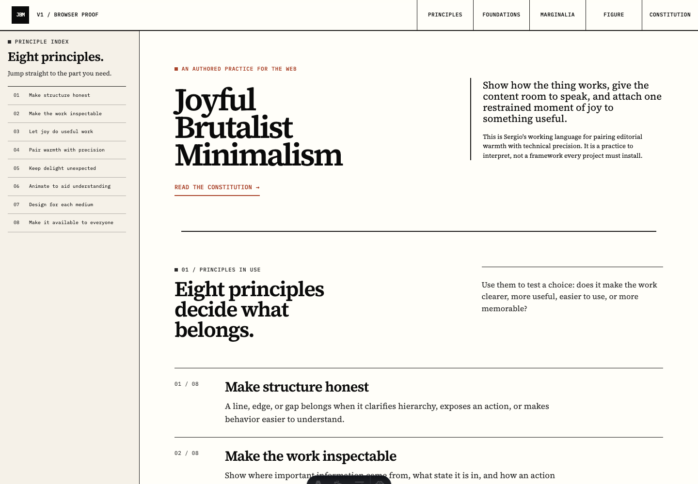
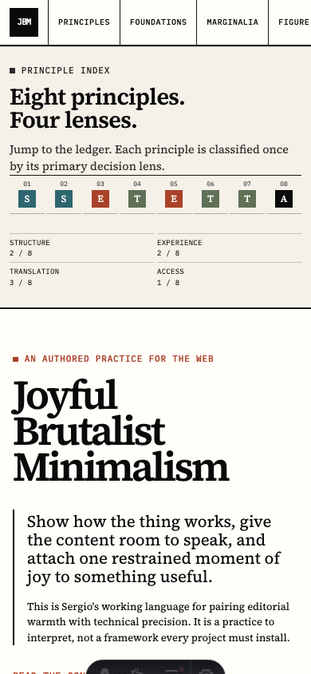
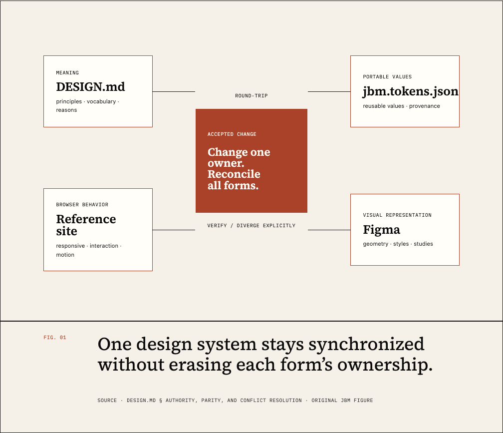
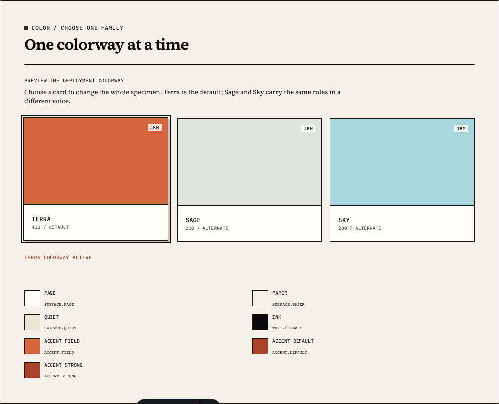
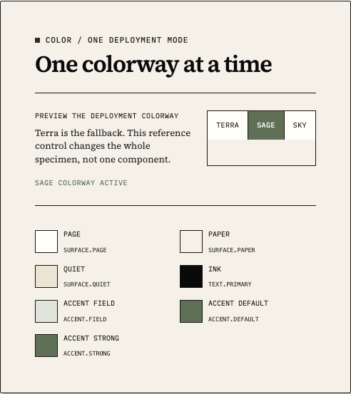
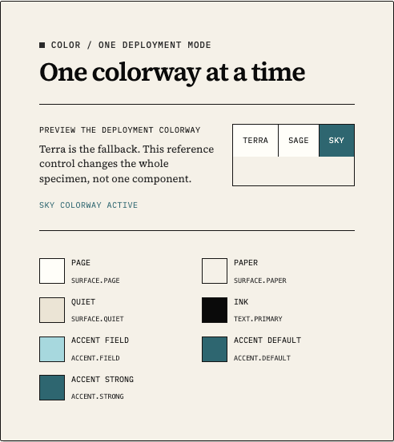
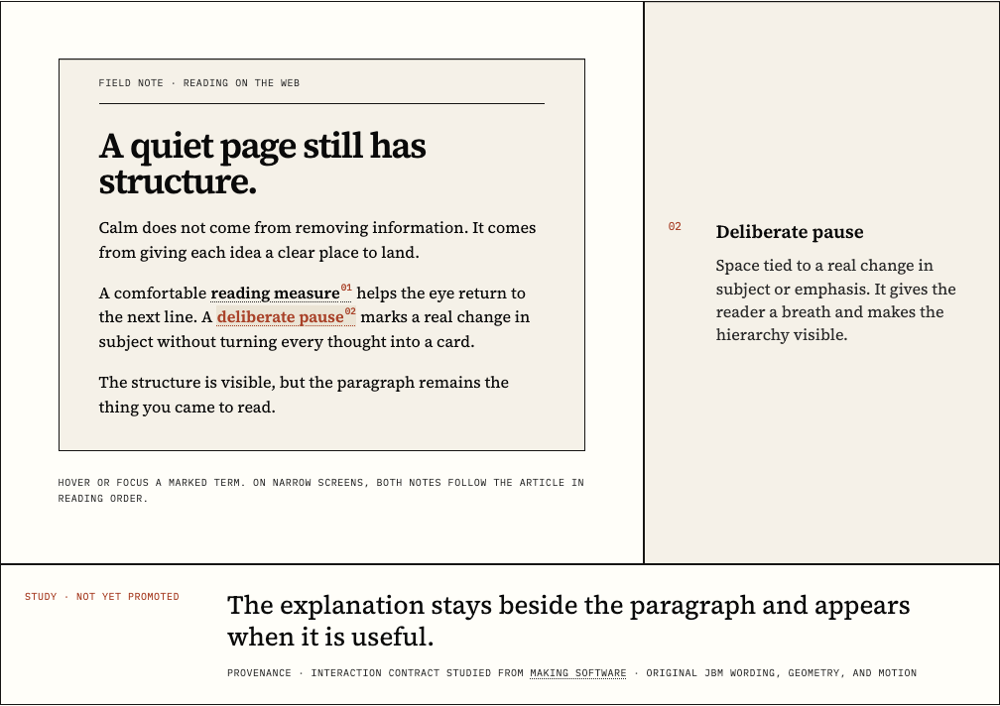

# Reference site v1 inspection receipt

The static [Astro browser specimen](../src/pages/index.astro) interprets the
repository-owned constitution, canonical tokens, and committed
[Figma library](https://www.figma.com/design/T4jEmsyQBURKMr6s3zYfFJ) as one
coherent page. It fulfills
[issue #6](https://github.com/chekos/joyful-brutalist-minimalism/issues/6)
and is reviewed in
[pull request #9](https://github.com/chekos/joyful-brutalist-minimalism/pull/9)
without creating a client component framework or changing a consumer repository.
The deployment-scoped colorway implementation is tracked in
[issue #31](https://github.com/chekos/joyful-brutalist-minimalism/issues/31)
and
[pull request #33](https://github.com/chekos/joyful-brutalist-minimalism/pull/33);
the separate Paper/Bone review remains open in
[issue #32](https://github.com/chekos/joyful-brutalist-minimalism/issues/32).
The clarity pass that followed direct browser review is tracked in
[issue #35](https://github.com/chekos/joyful-brutalist-minimalism/issues/35)
and
[pull request #36](https://github.com/chekos/joyful-brutalist-minimalism/pull/36).

Its authoritative inputs are [`DESIGN.md`](../DESIGN.md),
[`tokens/jbm.tokens.json`](../tokens/jbm.tokens.json), the generated
[`src/styles/tokens.css`](../src/styles/tokens.css), and the
[Figma v1 receipt](figma-v1.md).

## Browser result

- Astro produces one static route with vanilla CSS and a one-line capability
  class for progressive enhancement. There is no React, Vue, Svelte, or other
  client UI runtime.
- The page communicates the founding thesis, all eight principles, portable
  foundations, the seven authored forms, a two-step Technical Figure, a direct
  Principle Index, and one explicitly unpromoted Contextual Marginalia study in
  one editorial composition.
- Source Serif 4 and IBM Plex Mono are bundled locally so the approved
  Editorial and Instrument roles do not depend on a third-party font request.
- The generated CSS token file remains the only browser value bridge. Site CSS
  consumes its semantic properties rather than defining a parallel palette or
  motion scale.
- The document declares Terra as its one deployment colorway. The Foundations
  preview can switch the whole specimen to Sage or Sky without persisting a
  user preference or mixing palette families inside the interface taxonomy.

## Deployment colorways

The root `data-jbm-colorway` attribute selects one complete semantic accent
mapping. Terra is both the explicit reference-site default and the generated
fallback; Sage and Sky override the same `accent.field`, `accent.default`,
`accent.hover`, `accent.strong`, and `focus.ring` roles. Paper/Bone surfaces,
Ink, neutral rules, typography, geometry, and motion stay shared.

The preview is an accessible documentation control, not a site-wide preference
system. Its three buttons expose one pressed state, update a polite status, and
change the whole specimen. Without JavaScript the control stays hidden and the
complete Terra document remains readable. Unknown attribute values also fall
back to Terra. Lens names and principle indices remain neutral instead of
turning Terra, Sage, and Sky into permanent content categories.

## Content-derived Principle Index

The page defines one eight-item principle dataset. That same dataset renders
the principle ledger and its direct index links, so titles cannot drift between
the two without changing the source data.

The index says only what a reader needs to choose a destination: number and
title. It does not repeat the title as a glyph, classify the same item again by
lens, restate category counts, or pretend to measure reading progress. All
eight links remain readable and operable without JavaScript and jump directly
to their principle in the real ledger.

## Earned scale

The browser applies the reduction test from `DESIGN.md`: when smaller type
preserves hierarchy and comprehension, the larger treatment has no job. The
hero title remains the one true display moment; the thesis, support copy,
section headings, and typography specimen use restrained contextual sizes.
Whitespace now groups the hero's title, thesis, actions, and provenance instead
of staging a full viewport around monumental type. The committed Figma
`Earned scale` study records the comparison without introducing a portable size
token or changing the Plate grid.

## Contextual Marginalia study

The page adds an original two-annotation article example informed by the
interaction contract observed in
[Making Software](https://www.makingsoftware.com/chapters/how-to-make-a-font).
The source contributed the useful relationship—an annotated term temporarily
exchanges a side measure for contextual explanation—not reusable wording,
geometry, assets, code, rulers, or exact animation.

The default sidecar is an honest register of the passage's two real notes.
Hovering or focusing either bold, dotted-underlined term exchanges that register
for its matching note. Direct activation targets the same note without
JavaScript. At narrow widths and in print, the register disappears and both
notes flow directly after the passage. Reduced motion makes the exchange
immediate while preserving the state.

Decision 0002 keeps Contextual Marginalia as a named study until a second
genuinely different content context proves a stable contract. The live Figma
file now records the register, active-note, and narrow/print states. Existing
tokens were verified as exact coverage, so no new portable value was added.
No consumer-repository change is implied by the core JBM evidence.

## Authored forms in context

The page uses the seven Figma forms for their documented functions:

| Form | Browser use |
| --- | --- |
| Ground | The warm page field and bounded instrument surface |
| Kicker | Section, source, and evidence orientation |
| Rule | Section hierarchy, measure, and figure connection |
| Index Row | The inspectable eight-principle ledger |
| Plate | Color, type, pressure, and figure artifacts |
| Action Link | Explicit source and provenance destinations |
| Figure Caption | Figure identity, explanation, source, and originality note |

## Technical Figure

The figure explains the sync contract as two checks. First, identify which of
the four forms owns a change: meaning, portable values, visual representation,
or browser behavior. Then represent the result in every form, verify existing
coverage, mark it not applicable, or record a deliberate difference. The
linear explanation remains complete without decorative connectors.

## Semantic agreement and intentional differences

Figma and browser agree on vocabulary, semantic token roles, hard-edged paper
grammar, the four-owner round-trip relationship, Contextual Marginalia's three
representative states, the direct eight-principle index, and the earned-scale
reduction test.
The following differences belong to the browser medium:

- the two-column Principle Index becomes a sticky left rail on large screens
  and a horizontal source index on narrow screens;
- the rail remains static because all eight destinations are adjacent; direct
  fragment links expose useful navigation without fake progress;
- visible focus, logical keyboard order, touch behavior, responsive reflow,
  no-JavaScript navigation, and reduced-motion resolution are executable rather
  than visually simulated;
- the document, rail, and narrow mast use square, token-colored authored
  scrollbars instead of dropping an unconsidered system scrollbar into the
  composition; and
- the Technical Figure reflows from a four-column owner check into two or one
  column while preserving the same two-step explanation.

These are intentional translations, not token or meaning disagreements. The
current parity states and node evidence live in
[`docs/sync/manifest.json`](sync/manifest.json).

## Verification

`npm run verify` runs formatting, canonical token validation, generated parity,
Astro type checking, unit tests, the static build, and the Chromium suite. The
browser suite verifies:

- all eight source principles and all seven authored forms;
- content-derived static index links with no redundant lens encoding or fake
  progress;
- Terra as the default deployment colorway, complete whole-site Sage and Sky
  switching, one pressed state, and Terra fallback for unknown values;
- three equal colorway cards with no concurrent palette-family taxonomy;
- keyboard entry and visible focus;
- complete no-JavaScript content and fragment navigation;
- a realistic Contextual Marginalia article, plus its pointer, keyboard,
  activation, and narrow-layout states;
- reduced-motion duration, state, and reading content;
- exact annotated type roles, authored scrollbar styling, and no horizontal
  overflow at desktop, tablet, 200% zoom-equivalent, and mobile widths;
- automated accessibility analysis with axe; and
- desktop, mobile, and Technical Figure screenshot regression.

Independent agent-browser inspection also confirmed a complete accessibility
tree, clean desktop and mobile composition, and no console or page errors.

## Visual evidence

### Desktop composition

### Mobile composition

### Technical Figure in context

### Terra deployment colorway

### Sage deployment colorway

### Sky deployment colorway

### Contextual Marginalia in its note state

The executable visual baselines are stored with the browser tests in
[`tests/browser/__screenshots__`](../tests/browser/__screenshots__). They are
scoped to representative surfaces so failures remain reviewable.

## Publication boundary

The artifact is published at [jbm.bns.studio](https://jbm.bns.studio) through
the repository's GitHub Pages workflow. Public visibility and the Figma link do
not imply a license or automatic inheritance by consumer repositories.

The deployment-scoped colorway implementation shipped from
[pull request #33](https://github.com/chekos/joyful-brutalist-minimalism/pull/33)
as commit `3164ac1b39806f39ea9d8c020829490e88137005`.
[Pages run 29561194273](https://github.com/chekos/joyful-brutalist-minimalism/actions/runs/29561194273)
completed successfully. The public HTTPS response declares Terra at the root
and serves the generated Terra, Sage, and Sky selectors. A live Chromium smoke
verified whole-site Sage and Sky switching, exactly one pressed preview state,
and no console or page errors.
